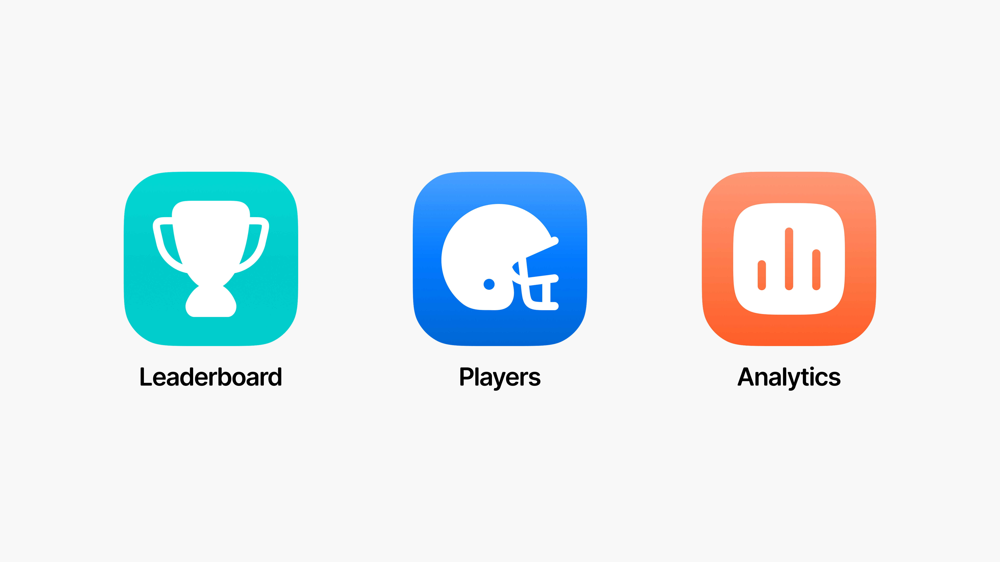

When we started designing and mapping out the initial experience for Playar’s alpha app — essentially version 0.1 — our goal was to build a first draft that could evolve as we better understood what worked and what didn’t. We aimed to make the app delightful, engaging, and purpose-driven.

---

## Our Threefold Design Approach

1. **Keep the UI Simple**  
   A straightforward interface allowed us to test essential functionalities quickly and build a foundation for more complex features later.

2. **Prototype Early**  
   We tested not just how the app looked, but how it felt. Early feedback from coaches who interacted with rough prototypes gave us valuable insights.

3. **Gather Feedback and Iterate Quickly**  
   We prioritized frequent feedback, even from half-built versions, to refine the design continuously and stay aligned with user needs.

---

## Insights from Coaches

Coaches shared specific needs:
- Comparing player performance
- Accessing player-specific stats
- Observing macro trends like averages

These inputs shaped the app’s functionality and user flows.

---

## Core Features in the Alpha

- **Leaderboard**  
  Compare and rank player performance across metrics — adding a gamified, competitive layer.

- **Player View**  
  Deep-dive into individual stats and progress, accessible per player.

- **Analytics**  
  Track macro-level patterns like consistency, power, and range.

---

These features became core tabs in the app, alongside a **Settings** tab to personalize the experience.

---

## Key Design Questions We Asked

To inform our decisions, we kept asking:
- Should the app feel playful or serious?
- What’s the goal of the app?
- Who is the primary user?
- How should we visually guide them?

We designed for balance — engaging but focused.

---

## Leaderboard Design Philosophy

The **Leaderboard** was the entry point for coaches. It offered quick comparison across players on:
- **Consistency**
- **Power**
- **Range**

But deeper questions had to be answered:
- What defines each metric?
- How are age groups handled?
- What’s the best way to visually compare performance?

The leaderboard became a blend of UI logic and coaching utility — built using Flutter, with a mix of native-like familiarity and cross-platform flexibility.

---

## Conclusion

Behind every screen was a constant question: “Does this help the coach or player get better?”  
This thinking shaped the Playar Alpha — a foundation built for feedback, growth, and play.

